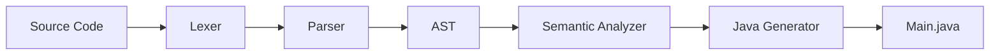

# 🧠 Synapse

<div align="center">

# Synapse

**Un lenguaje de programación compilado para aprender cómo funciona un compilador moderno.**


</div>

---

## 📖 Tabla de contenidos

- [Características](#-características)
- [Arquitectura](#-arquitectura)
- [Instalación](#-instalación)
- [Uso](#-uso)
- [Roadmap](#-roadmap)

---

## ✨ Características

- ✅ Declaración de variables
- ✅ Tipos primitivos
- ✅ Asignaciones
- ✅ Operaciones aritméticas
- ✅ Comparaciones
- ✅ Expresiones booleanas
- ✅ `if`
- ✅ `while`
- ✅ Scopes
- ✅ Análisis semántico
- ✅ Generación de código Java

---

## 🏗 Arquitectura



## 🚀 Instalación

Sigue estos pasos para obtener una copia local del proyecto y ejecutar el compilador.

### 1. Clona el repositorio

Descarga el código fuente desde GitHub utilizando `git clone`.

```bash
git clone https://github.com/tu-usuario/synapse.git
```

### 2. Entra al directorio del proyecto

```bash
cd synapse
```

### 3. Crea un entorno virtual (opcional, pero recomendado)

Esto mantiene las dependencias del proyecto aisladas de otras instalaciones de Python.

```bash
python -m venv .venv
```

### 4. Activa el entorno virtual

**Windows**

```bash
.venv\Scripts\activate
```

**Linux / macOS**

```bash
source .venv/bin/activate
```

### 5. Instala las dependencias

Instala todas las bibliotecas necesarias para ejecutar el compilador.

```bash
pip install -r requirements.txt
```

Una vez completados estos pasos, Synapse estará listo para utilizarse.
